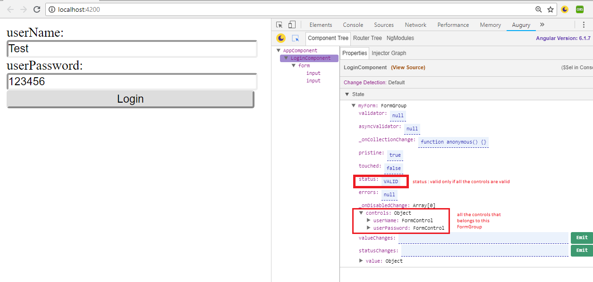
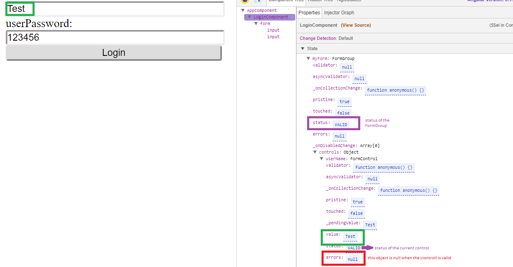
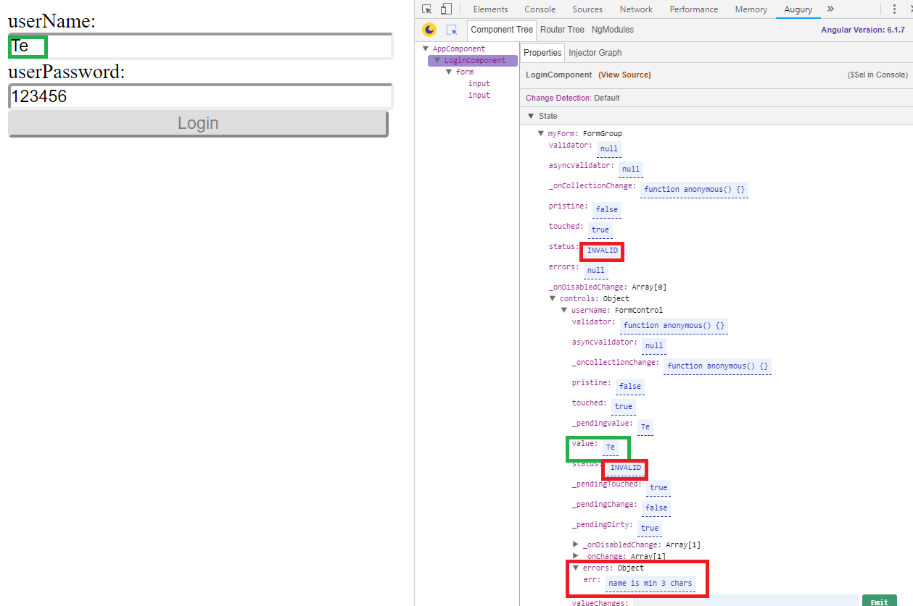

# Reactive forms

*NOTE*: add to `imports` array in `src/app/app.module.ts`:
  ```
  imports: [
    BrowserModule,
    FormsModule,
    ReactiveFormsModule
  ]
  ```

## Accessing the FormGroup properties:
   
   


## Run this app in dev mode:
```bash
npm i
ng serve --open
```

